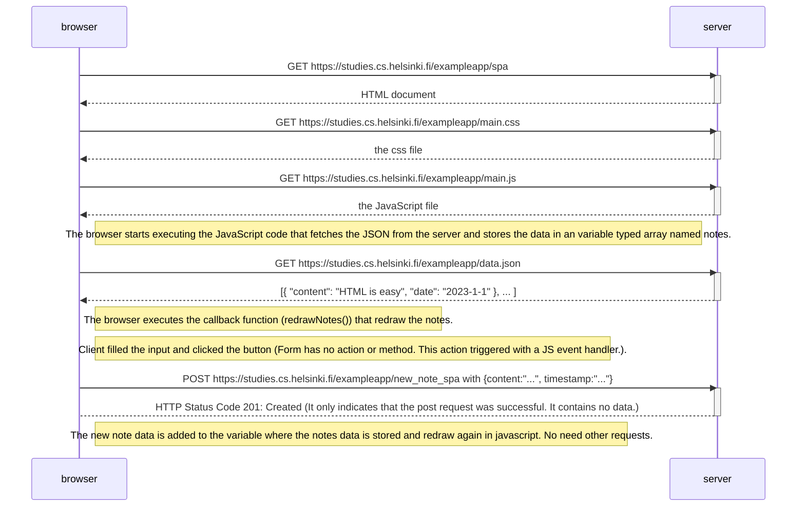

```mermaid
sequenceDiagram
    participant browser
    participant server

    browser->>server: GET https://studies.cs.helsinki.fi/exampleapp/spa
    activate server
    server-->>browser: HTML document
    deactivate server

    browser->>server: GET https://studies.cs.helsinki.fi/exampleapp/main.css
    activate server
    server-->>browser: the css file
    deactivate server

    browser->>server: GET https://studies.cs.helsinki.fi/exampleapp/main.js
    activate server
    server-->>browser: the JavaScript file
    deactivate server

    Note right of browser: The browser starts executing the JavaScript code that fetches the JSON from the server and stores the data in an variable typed array named notes.

    browser->>server: GET https://studies.cs.helsinki.fi/exampleapp/data.json
    activate server
    server-->>browser: [{ "content": "HTML is easy", "date": "2023-1-1" }, ... ]
    deactivate server

    Note right of browser: The browser executes the callback function (redrawNotes()) that redraw the notes.

    Note right of browser: Client filled the input and clicked the button (Form has no action or method. This action triggered with a JS event handler.).
    browser->>server: POST https://studies.cs.helsinki.fi/exampleapp/new_note_spa with {content:"...", timestamp:"..."}
    activate server
    server-->browser: HTTP Status Code 201: Created (It only indicates that the post request was successful. It contains no data.)
    deactivate server

    Note right of browser: The new note data is added to the variable where the notes data is stored and redraw again in javascript. No need other requests.
```
